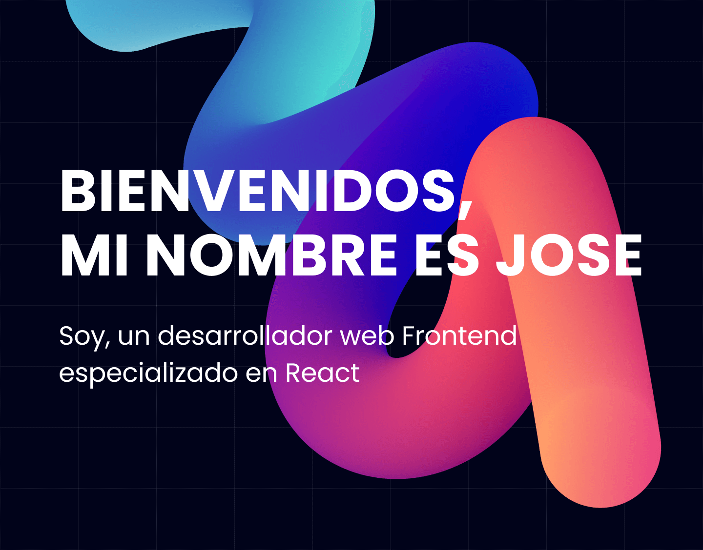

# 🤖 Portafolio Personal

Mi portafolio personal creado con React, TypeScript y SASS

[Mira el sito aquí](https://joseluria.com/)

## ⚙️ Esta aplicación fue construida usando las siguientes tecnologías

- [TypeScript](https://www.typescriptlang.org/)
- [React](https://reactjs.org/)
- [Vite](https://vitejs.dev/)
- [Sass](https://sass-lang.com/)

## 📄 Licencia

[MIT](https://opensource.org/licenses/MIT)
